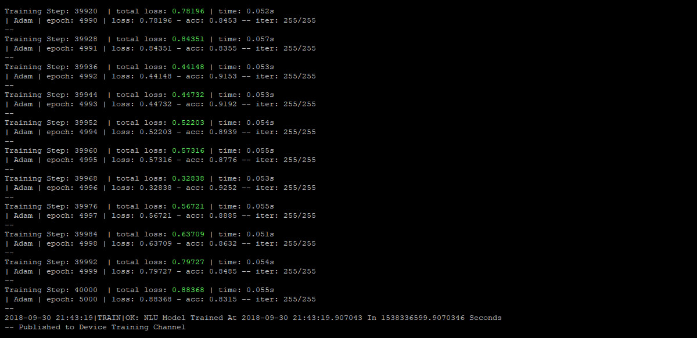
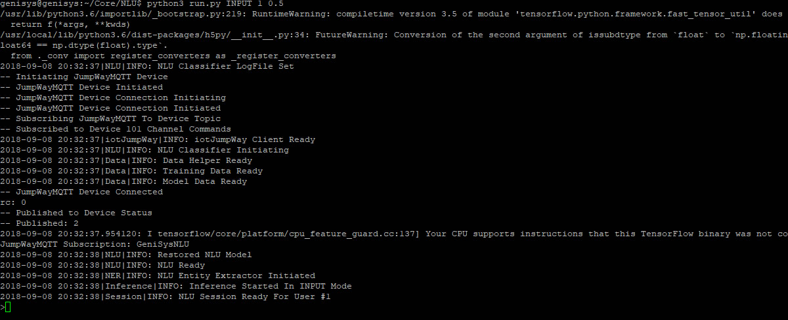

# GeniSys NLU Engine
[](https://github.com/GeniSysAI/NLU)

[](https://github.com/GeniSysAI/NLU/tree/0.0.1)
[](https://github.com/GeniSysAI/NLU/tree/0.0.2)

# About GeniSys AI

GeniSys AI is an open source Artificial Intelligence Assistant Network using Computer Vision, Natural Linguistics and the Internet of Things. GeniSys uses a system based on [TASS A.I](https://github.com/TASS-AI/TASS-Facenet "TASS A.I") for [vision](https://github.com/GeniSysAI/Vision "vision"), an [NLU engine](https://github.com/GeniSysAI/NLU "NLU engine") for natural language understanding, in browser speech synthesis and speech recognition for speech and hearing, all homed on a dedicated Linux server in your home and managed via a secure UI.

# About GeniSys NLU Engine

I orginally developed what is now the [GeniSys NLU Engine](https://github.com/GeniSysAI/NLU "GeniSys NLU Engine") back in 2017 ([How I built a fully functional Deep Learning Neural Network chatbot platform (NLU Engine) in under a week....](https://www.techbubble.info/blog/artificial-intelligence/chatbots/entry/deep-learning-neural-network-nlu-engine "How I built a fully functional Deep Learning Neural Network chatbot platform (NLU Engine) in under a week....")). The project was originally developed to take over **DialogFlow**, or what was known back then as **API.AI** in some commercial AI projects I had built, after I closed the business down it became a personal project for my home and as I have open sourced most of my other projects, it made sense to open source this one.

The NLU Engine includes a combination of a custom trained DNN (Deep Learning Neural Network) built using [TFLearn](http://tflearn.org/ "TFLearn") for intent classification, and a custom trained [MITIE](https://github.com/mit-nlp/MITIE "MITIE") model for entity classification. The engine can can handle not only named entities, but synonyms also and both features are used by the core training module.

# What Will We Do?

This tutorial will help you setup the NLU Engine required for your GeniSys network, and also takes you through setting up iotJumpWay devices. In detail this guide will cover the following:

- Installing and setting up required software
- Creating your intent and entity training data
- Training your intent and entity classifiers
- Testing your classifier locally
- Testing your classifier locally in real time
- Testing your classifier API via a client

# Example Output

The following is an unedited conversation within the basic capabilities provided by the example training data (The full response print out has been removed to make it easy to follow the conversation):

```
>Hi how are you today?
2018-09-08 20:07:18|Human|Intent: Hi how are you today?
2018-09-08 20:07:18|GeniSys|STATUS: Processing
2018-09-08 20:07:18|GeniSys|Reponse: Hi, I am good thank you, how are you?
>I am very good thank you for asking
2018-09-08 20:07:29|Human|Intent: I am very good thank you for asking
2018-09-08 20:07:29|GeniSys|STATUS: Processing
2018-09-08 20:07:29|GeniSys|Reponse: Good, how can I help you?
>What would I call you if I were to speak to you?
2018-09-08 20:07:47|Human|Intent: What would I call you if I were to speak to you?
2018-09-08 20:07:47|GeniSys|STATUS: Processing
2018-09-08 20:07:47|GeniSys|Reponse: You can call me Geni (Jenny), but my real name is GeniSys
>thank you
2018-09-08 20:07:55|Human|Intent: thank you
2018-09-08 20:07:55|GeniSys|STATUS: Processing
2018-09-08 20:07:55|GeniSys|Reponse: My pleasure
>Would you happen to know what time it is ?
2018-09-08 20:08:13|Human|Intent: Would you happen to know what time it is ?
2018-09-08 20:08:13|GeniSys|STATUS: Processing
2018-09-08 20:08:13|GeniSys|Reponse: Right now it is Sat Sep  8 20:08:13 2018
>cool thank you
2018-09-08 20:08:24|Human|Intent: cool thank you
2018-09-08 20:08:24|GeniSys|STATUS: Processing
2018-09-08 20:08:24|GeniSys|Reponse: No problem!
```

In the conversation above, when I asked the time, the action attached to the related intent in the training data is triggered, basically an action is the path to a function in one of your custom classes, you can find out more about this later in the tutorial.

# Operating System

- Tested on [Ubuntu 18.04.1 LTS (Bionic Beaver)](http://releases.ubuntu.com/18.04/ "Ubuntu 18.04.1 LTS (Bionic Beaver)"), previous versions have been tested in Windows successfully but you need to make sure you install MITIE correctly on your Windows machine.

# Python Versions

- Tested with Python 3.5

# Software Requirements

- [Tensorflow 1.4.0](https://www.tensorflow.org/install "Tensorflow 1.4.0")
- [TFLearn](http://tflearn.org/ "TFLearn")
- [MITIE](https://github.com/mit-nlp/MITIE "MITIE")
- [NTLK (Natural Language Toolkit)](https://www.nltk.org/ "NTLK (Natural Language Toolkit)")
- [iotJumpWay MQTT Client](https://github.com/iotJumpway/JumpWayMQTT "iotJumpWay MQTT Client")

# Hardware Requirements

- 1 x Desktop device or laptop for development and training, prefereably with an NVIDIA GPU

# Installation & Setup

The following guides will give you the basics of setting up a GeniSys NLU Engine. 

## Clone The GeniSys NLU Engine Repo

First you need to clone the NLU Engine repo to the machine you will be running it on. To do so, navigate to the directory you want to place it in terminal and execute the following command:

```
 $ git clone https://github.com/GeniSysAI/NLU.git
```

Once you have done this, you have all the code you need on your machine. 

## Install The Required Software

Now you need to install the required software, I have provided a requirements file that will contain all required modules for the project. You can use it to install the modules using the following command: 

```
 $ sh setup.sh 
```

The command execute the setup shell file which will istall the required software for the project including **NTLK**, **TFLearn**, **MITIE** and **iotJumpWay**.

# Set Up iotJumpWay

Now you need to setup some an iotJumpWay device that will represent your NLU Engine on the Internet of Things. The following part of the tutorial will guide you through the process. 

- [Find out about the iotJumpWay](https://www.iotjumpway.tech/how-it-works "Find out about the iotJumpWay") 
- [Find out about the iotJumpWay Dev Program](https://www.iotjumpway.tech/developers/ "Find out about the iotJumpWay Dev Program") 
- [Get started with the iotJumpWay Dev Program](https://www.iotjumpway.tech/developers/getting-started "Get started with the iotJumpWay Dev Program") 

[](https://www.iotJumpWay.tech/console)

First of all you should [register your free iotJumpWay account](https://www.iotjumpway.tech/console/register "register your free iotJumpWay account"), all services provided by the iotJumpWay are also entirely free within fair limits. Once you have registered you need to:

- Create your iotJumpWay location [(Documentation)](https://www.iotjumpway.tech/developers/getting-started-locations "(Documentation)") 
- Create your iotJumpWay zones [(Documentation)](https://www.iotjumpway.tech/developers/getting-started-zones "(Documentation)")  
- Create your iotJumpWay devices [(Documentation)](https://www.iotjumpway.tech/developers/getting-started-devices "(Documentation)") 

Once you have set up your iotJumpWay device, you should update the [configuration file](https://github.com/GeniSysAI/NLU/blob/master/required/confs.json "configuration file")  with your iotJumpWay credentials. 

# Training Data

Now it is time to think about training data. In the [data/training.json](https://github.com/GeniSysAI/NLU/blob/master/data/training.json "data/training.json") file I have provided some starter data, it is not a lot but enough to have a good test and show the example further on in the tutorial. The example will show how you can attach actions to your intents in your training data which map to functions in your custum python classes, if you have seen the videos on my YouTube about the AI Ecommerce I made last year, a similar approach was uses in that system using DialogFlow. 

# Training Your NLU Engine

[](https://github.com/GeniSysAI/NLU/blob/master/Train.py)

Now everything is set up, it is time to train. The main functionality for the training process can be found in [Train.py](https://github.com/GeniSysAI/NLU/blob/master/Train.py "Train.py"), [tools/Data.py](https://github.com/GeniSysAI/NLU/blob/master/tools/Data.py "tools/Data.py"), [tools/Model.py](https://github.com/GeniSysAI/NLU/blob/master/tools/Model.py "tools/Model.py") and  [tools/Mitie.py](https://github.com/GeniSysAI/NLU/blob/master/tools/Mitie.py "tools/Mitie.py"), the configuration for training can be found and modified in [required/confs.json](https://github.com/GeniSysAI/NLU/blob/master/required/confs.json "required/confs.json").

To begin training, make sure you are all set up, navigate to the root of the project and execute the following command:

```
 $ python3 run.py TRAIN
```

[](https://github.com/GeniSysAI/NLU/blob/master/Train.py)

# Communicating with your AI

Now you have trained your AI, it is time to test her out! In this tutorial I will base my explanation on the conversation block at the beginning of this tutorial. 

As your AI is now trained, all you need to do (assuming you are in the project root), is execute the following code:

```
 $ python3 run.py INPUT  1 0.5
```
What this does is starts up a session using the user ID of 1 and a threshold of 0.5, sometimes if your model is misclassifying it can help to play with this threshold. 

[](https://github.com/GeniSysAI/NLU/blob/master/run.py)

In the case of the example, the action (actions.NLUtime.getTime) converts the %%TIME%% value in a randomly chosen action response and replaces the original response. You can write your own functionality or link the response to other modules as you like, the limit is your imagination ;) 

```
"action":  {
    "function": "actions.NLUtime.getTime",
    "responses": [
        "The time is %%TIME%%",
        "Right now it is %%TIME%%",
        "It is around %%TIME%%"
    ]
}
```

Regarding the classifications in general, if you have looked through the example data, you may notice that none of the things that I said in the above script had been directly trained to the AI. For example, with the question **What would I call you if I were to speak to you?**, the actual training data provided to the AI related to this question is actually:

```
"text": [
    "What is your name",
    "Whats your name",
    "What do they call you",
    "What can I call you",
    "Who are you",
    "Tell me your name"
]
```

You can see that the example above was not in the training data, but the AI was still able to classify and respond correctly. 

# Stay Tuned!!

There are more features from my original version that are still yet to be implemented plus some other cool features, pluse the combined system of all three GeniSys AI repos.

# Contributing
Please read [CONTRIBUTING.md](https://github.com/GeniSysAI/NLU/blob/master/CONTRIBUTING.md "CONTRIBUTING.md") for details on our code of conduct, and the process for submitting pull requests to us.

# Versioning
We use SemVer for versioning. For the versions available, see the tags on this repository and [RELEASES.md](https://github.com/GeniSysAI/NLU/blob/master/RELEASES.md "RELEASES.md").

# License
This project is licensed under the **MIT License** - see the [LICENSE](https://github.com/GeniSysAI/NLU/blob/master/LICENSE "LICENSE") file for details.

# Bugs/Issues
We use the [repo issues](https://github.com/GeniSysAI/NLU/issues "repo issues") to track bugs and general requests related to using this project. 

# Author
[](https://github.com/AdamMiltonBarker)